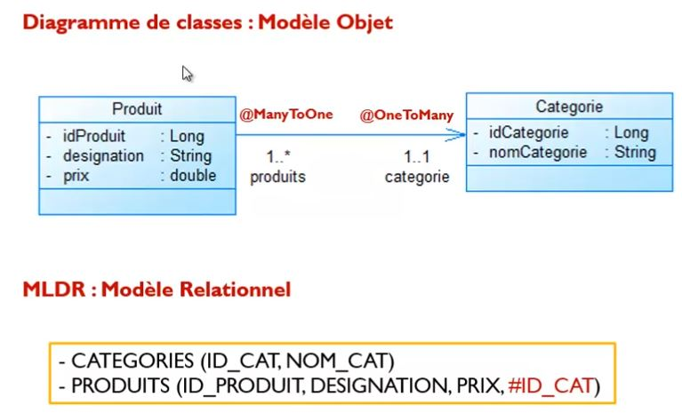
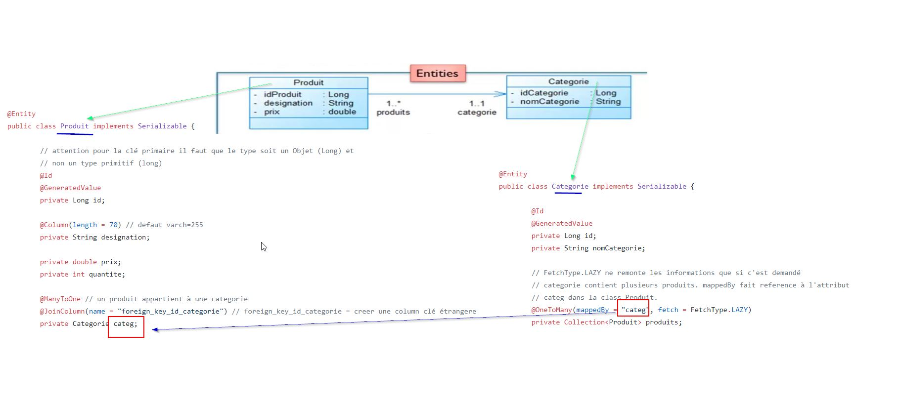
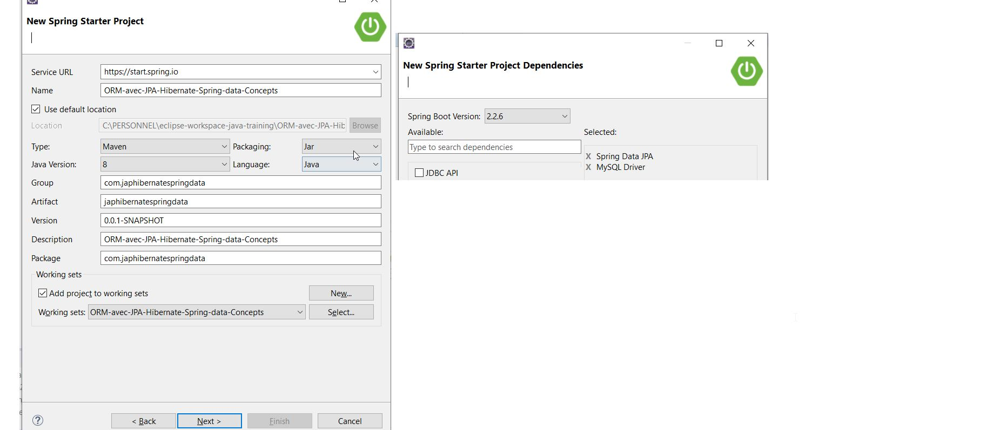
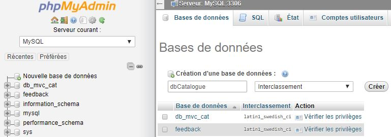

# Mies en Oeuvre avec Spring Data

## Diagramme de class UML







## Creation d'un projet Spring 




Attention , l'Id de l'entité doit disposée d'un typage Objet ( Integer ) qui commence par une majuscule et nom d'un type primitif ( exemple: int). Car les parametres  del'interface généric JPA **JPARepositoy< Entity.class,IDentity >** sont de type Object.

Les **entities** doivent etre dans le package parent initial ou sous package du projet ( ici comme exemple: **com.japhibernatespringdata**)

**long** is a **primitive**, which must have a value. Simple.

**Long** is an **object**, so:

- it can be **null** (meaning whatever you like, but "unknown" is a common interpretation)
- it can be **passed to a method that accepts an Object**, Number, Long or long parameter (the last one thanks to auto-unboxing)
- it can be used an a **generic parameter type**, ie List<Long> is OK, but List<long> is not OK
- it can be **serialized/deserialized** via the java serialization mechanism


### Ceation de la base de données mysql



### Configuration fichier application.properties

**Atention**: **spring.jpa.hibernate.ddl-auto = create** drope toutes les tables à chaque relancer de l'application. Ceci est essementiellemnt utilise pour les phases de test.
```properties
spring.datasource.url = jdbc:mysql://localhost:3306/dbCatalogue?useSSL=false&serverTimezone=UTC
spring.datasource.username = root
spring.datasource.password = password
spring.datasource.driver-class-name = com.mysql.cj.jdbc.Driver
spring.jpa.show-sql = true
spring.jpa.hibernate.ddl-auto = create
#spring.main.banner-mode = off
spring.jpa.properties.hibernate.dialect = org.hibernate.dialect.MySQL5Dialect
```


### Creation des entités

Les éléments obligatoires dans une entités sont **@id** et  **@GenerateValue**.  
Par defaut un String est un varChar à 255 caractère. Pour limiter la longeur on peut le specifier avec ** length. **@Column(length = 70)**.  

Les entités doivent etre localiser dans le package parent ( ou packages enfants ) défini lors de la création du projet spring. 
**Entity Produit**
   
````java
package com.japhibernatespringdata.entities;

import java.io.Serializable;

import javax.persistence.Column;
import javax.persistence.Entity;
import javax.persistence.GeneratedValue;
import javax.persistence.Id;
import javax.persistence.JoinColumn;
import javax.persistence.ManyToOne;

@Entity
public class Produit implements Serializable {

	// attention pour la clé primaire il faut que le type soit un Objet (Long) et
	// non un type primitif (long)
	@Id
	@GeneratedValue
	private Long id;

	@Column(length = 70) // defaut varch=255
	private String designation;

	private double prix;
	private int quantite;

	@ManyToOne // un produit appartient à une categorie
	@JoinColumn(name = "foreign_key_id_categorie") // foreign_key_id_categorie = creer une column clé étrangere
	private Categorie categ;

	public String getDesignation() {
		return designation;
	}

	public void setDesignation(String designation) {
		this.designation = designation;
	}

	public double getPrix() {
		return prix;
	}

	public void setPrix(double prix) {
		this.prix = prix;
	}

	public int getQuantite() {
		return quantite;
	}

	public void setQuantite(int quantite) {
		this.quantite = quantite;
	}

	public Categorie getCateg() {
		return categ;
	}

	public void setCateg(Categorie categ) {
		this.categ = categ;
	}

	public Produit(String designation, double prix, int quantite, Categorie categ) {
		super();
		this.designation = designation;
		this.prix = prix;
		this.quantite = quantite;
		this.categ = categ;
	}

	public Produit() {
		super();
		// TODO Auto-generated constructor stub
	}

}
````


Entity **Catagorie**

```java
package com.japhibernatespringdata.entities;

import java.io.Serializable;
import java.util.Collection;

import javax.persistence.Entity;
import javax.persistence.FetchType;
import javax.persistence.GeneratedValue;
import javax.persistence.Id;
import javax.persistence.OneToMany;

@Entity
public class Categorie implements Serializable {

	@Id
	@GeneratedValue
	private Long id;
	private String nomCategorie;

	// FetchType.LAZY ne remonte les informations que si c'est demandé
	// categorie contient plusieurs produits. mappedBy fait reference à l'attribut
	// <<categ>> dans la class <<Produit>>.
	@OneToMany(mappedBy = "categ", fetch = FetchType.LAZY)
	private Collection<Produit> produits;

	public Long getId() {
		return id;
	}

	public void setId(Long id) {
		this.id = id;
	}

	public String getNomCategorie() {
		return nomCategorie;
	}

	public void setNomCategorie(String nomCategorie) {
		this.nomCategorie = nomCategorie;
	}

	public Collection<Produit> getProduits() {
		return produits;
	}

	public void setProduits(Collection<Produit> produits) {
		this.produits = produits;
	}

	public Categorie(String nomCategorie) {
		super();
		this.nomCategorie = nomCategorie;
	}

	public Categorie() {
		super();
		// TODO Auto-generated constructor stub
	}

}
```

### Les interfaces 

**Interface ICategorieRespository.**  

L'heritage de l'interface JpaRespository implique la création automatique par Spring des methodes CRUD de base. save,remove, findOne, findAll ...

````java
package com.japhibernatespringdata.dao;

import org.springframework.data.jpa.repository.JpaRepository;

import com.japhibernatespringdata.entities.Categorie;

public interface ICatagorieRepository extends JpaRepository<Categorie, Long> {

}

````


**Interface IProduitRespository.**  


Ici nous creer une methode abstraite **findByDesignation** pour répondre à un besoin qui n'est pas implémenté par String data. Il n'est pas nécessaire de creer son implémentation. Spring se chargera de le faire automatiquement grace à la requete **HQL** qui accompagne cette méthode.    


````java
package com.japhibernatespringdata.dao;

import java.util.List;

import org.springframework.data.jpa.repository.JpaRepository;
import org.springframework.data.jpa.repository.Query;
import org.springframework.data.repository.query.Param;

import com.japhibernatespringdata.entities.Produit;

public interface IProduitRepository extends JpaRepository<Produit, Long> {

	// Pas besoin de faire une implementation des methodes de base spring car elles
	// sont faite par spring.

	// Ajouter nos propres interface qui sont specifiques n'existant parmis les
	// methode bases dans spring/
	@Query("select p from Produit p where p.designation like :x")
	public List<Produit> findByDesignation(@Param("x") String mc);

}

````


## Classe Main


**ctx.getBean(IProduitRepository.class)** demande à spring de scaner le projet et de recherche l'interface **IProduitRepository** puis instancie celle ci.

On créé des categories puis des produits.

````java  
package com.japhibernatespringdata;

import java.util.List;

import org.springframework.boot.SpringApplication;
import org.springframework.boot.autoconfigure.SpringBootApplication;
import org.springframework.context.ApplicationContext;

import com.japhibernatespringdata.dao.ICatagorieRepository;
import com.japhibernatespringdata.dao.IProduitRepository;
import com.japhibernatespringdata.entities.Categorie;
import com.japhibernatespringdata.entities.Produit;

@SpringBootApplication
public class OrmAvecJpaHibernateSpringDataConceptsApplication {

	public static void main(String[] args) {
		ApplicationContext ctx = SpringApplication.run(OrmAvecJpaHibernateSpringDataConceptsApplication.class, args);

		// -------------------------------------------------------------------
		ICatagorieRepository categorieDao = ctx.getBean(ICatagorieRepository.class); // renvoi une instance de
																						// ICatagorieRepository
		Categorie categ1 = new Categorie("Ordinateur");
		Categorie categ2 = new Categorie("imprimante");
		Categorie categ3 = new Categorie("Scanner");

		categorieDao.save(categ1);
		categorieDao.save(categ2);
		categorieDao.save(categ3);

		// -------------------------------------------------------------------

		IProduitRepository produitDao = ctx.getBean(IProduitRepository.class); // renvoi une instance de
																				// IProduitRepository
		produitDao.save(new Produit("Ordinateur LX567", 7000, 7, categ1));
		produitDao.save(new Produit("Ordinateur HP pavillon 645", 5000, 8, categ1));
		produitDao.save(new Produit("Imprimante lastjet HP 785", 2000, 6, categ2));
		produitDao.save(new Produit("Imprimante lastjet HP 8794", 2000, 6, categ2));
		produitDao.save(new Produit("Scan canon DXdffd", 2000, 6, categ3));

		List<Produit> produits = produitDao.findAll();
		for (Produit p : produits) {
			System.out.println("Des:" + p.getDesignation() + " prix: " + p.getPrix() + " quantité: " + p.getQuantite()
					+ " categorie: " + p.getCateg().getNomCategorie());
		}

		List<Produit> produits1 = produitDao.findByDesignation("%H%");
		for (Produit p : produits1) {
			System.out.println("Des:" + p.getDesignation() + " prix: " + p.getPrix() + " quantité: " + p.getQuantite()
					+ " categorie: " + p.getCateg().getNomCategorie());
		}

	}

}

````


## Resultat

````text
Hibernate: select produit0_.id as id1_1_, produit0_.id_categorie as id_categ5_1_, produit0_.designation as designat2_1_, produit0_.prix as prix3_1_, produit0_.quantite as quantite4_1_ from produit produit0_
Hibernate: select categorie0_.id as id1_0_0_, categorie0_.nom_categorie as nom_cate2_0_0_ from categorie categorie0_ where categorie0_.id=?
Hibernate: select categorie0_.id as id1_0_0_, categorie0_.nom_categorie as nom_cate2_0_0_ from categorie categorie0_ where categorie0_.id=?
Hibernate: select categorie0_.id as id1_0_0_, categorie0_.nom_categorie as nom_cate2_0_0_ from categorie categorie0_ where categorie0_.id=?
Des:Ordinateur LX567 prix: 7000.0 quantité: 7 categorie: Ordinateur
Des:Ordinateur HP pavillon 645 prix: 5000.0 quantité: 8 categorie: Ordinateur
Des:Imprimante lastjet HP 785 prix: 2000.0 quantité: 6 categorie: imprimante
Des:Imprimante lastjet HP 8794 prix: 2000.0 quantité: 6 categorie: imprimante
Des:Scan canon DXdffd prix: 2000.0 quantité: 6 categorie: Scanner
Hibernate: select produit0_.id as id1_1_, produit0_.id_categorie as id_categ5_1_, produit0_.designation as designat2_1_, produit0_.prix as prix3_1_, produit0_.quantite as quantite4_1_ from produit produit0_ where produit0_.designation like ?
Hibernate: select categorie0_.id as id1_0_0_, categorie0_.nom_categorie as nom_cate2_0_0_ from categorie categorie0_ where categorie0_.id=?
Hibernate: select categorie0_.id as id1_0_0_, categorie0_.nom_categorie as nom_cate2_0_0_ from categorie categorie0_ where categorie0_.id=?
Des:Ordinateur HP pavillon 645 prix: 5000.0 quantité: 8 categorie: Ordinateur
Des:Imprimante lastjet HP 785 prix: 2000.0 quantité: 6 categorie: imprimante
Des:Imprimante lastjet HP 8794 prix: 2000.0 quantité: 6 categorie: imprimante
````
