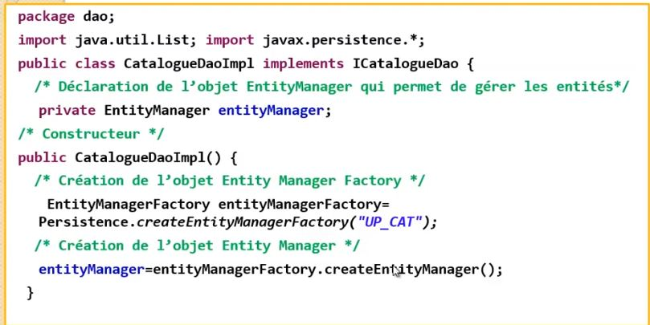

#ORM avec JPA Hibernate Spring data Concepts


[video 1](https://www.youtube.com/watch?v=tk2tZYUaKpU)
[video 2](https://www.youtube.com/watch?v=KPn84UvHzqs)


## Architecture J2EE


## vue d'ensemble


## Resumer
Il faut préviligier l'usage de **spring data** visa à vis de **entityManager** de JPA vec ou sans spring. Car Spring data va effectuer les opérations pour nous 


## Introduction  JPA et Hibernate ( sans Spring frameWork)

###  Mapping objets relationels ( ORM) avec Hibernate
Ce code devient tres vide fastidieux lors que l'on est amené à travailler avec beacoup de tables avec potentiellement des changements de schéma de la base de données.
Travailler dans les deux univers que sont l'orienté Objet et la base de données relationnelle peut etre lourd et consommateur en temps.
En production il ne faut jamais effectuer une telle production de code. Il faut préviligié l'utilisation de **Hibernetes** pour le mapping objet/relationnel pour java.

le terme **mapping Objet/Relationnel** (ORM) décrit la technique consistant à faire le lien entre la représentation objet des données et a représentation relatinnelle basée sur un schéma SQL.


### Hibernate
Le principe D'**hibernate** est de libérer le développeur de 95 pourcent des taches de programmation liées à la pesistance des données communes.
**Hibernate** assure également la **portabilité** de votre application si vous changer de SGBD relationnelle. ( Mysql -> Oracla). Hibernate propose au développeur une methode unique d'accès au base de données plus efficace.

### JPA.
 **JPA** définit un ensemble d'interfaces, de classes abstraites et d'annotations qui permettent la  description du Mapping objet relationnel.
 
 Il existe pluieurs **implémentation de JPA** ( Interface)
 - **Hibernate** (implémentation de JPA)
 - **Toplink** (implémentation de JPA)
 - **IBatis** (implémentation de JPA)
-  **EclipseLink** (implémentation de JPA)
 
  
L'utlisation de **JPA** permet à votre application d'etre **indépendante du FrameWork ORM** utilisé.
Ici l'application va directement utilisé l'interface JPA, Au demarrage de l'application il faut faire une injection of Control pour spécifié que FrameWork ORM utilisé.


## Approche de l'architecture d'Hibernate.
 
Il existe deux moyens de mapper les entités:
- La créatoin des fichiers XML de mapping
- Utilisation d'annotatoin JPA.

L'utlisation des annotation JPA laisse votre code indépendant de l'implementation des Frameworks ORM.

La création des fichiers XML de mapping a l'avantage de séparer le code java du mapping objet relationnel.

**Ici nous allons utiliser les annotations JPA ( au lieu de fichiers XML)**


## Annotation JPA 

L'API propose plusieurs annotations pour supporter un mapping O/R assez complet.

|Annotation |	Rôle|
|---|---|
|@javax.persistence.**Table**| 	Préciser le nom de la table concernée par le mapping|
|@javax.persistence.**Column**| 	Associer un champ de la table à la propriété (à utiliser sur un getter)|
|@javax.persistence.**Id**| Associer un champ de la table à la propriété en tant que clé primaire (à utiliser sur un getter)|
|@javax.persistence.**GeneratedValue**| 	Demander la génération automatique de  la clé primaire au besoin|
|@javax.persistence.**Basic**| 	Représenter la forme de mapping la plus simple. Cette annotation est utilisée par défaut|
|@javax.persistence.**Transient**| 	Demander de ne pas tenir compte du champ lors du mapping|


    
### entities

**Annotations JPA**

Seules les annotations **Entity** et **Id** sont **obligatoires**.

- @**Entity** = Défini la classe comme étant une table
- @**Table** = Nommage du Table
- @**Column** = Nommage d'une colonne ( attribut de la classe.)
- @**Id** = clé primaire de la table
- @**GeneratedValue** = Auto génération de la clé. IDENTITY ( increment + 1)

Le FrameWork **Hibernate** crée automatique toutes les tables grace aux directives **dll** dans le fichier de configuration persistent.xml.


Exemple d'une Etity **Produit**


## HQL

**HQL** est un language de **requetage de JPA**. Au lieu d'utiliser les tables nous utilisons les relations et les classes. **Hibernate** va traduire le **HQL** en **SQL** specifique au moteur SGBD. 

- Il faut créer un objet EntityManagerFactory et lui fournir le nom du **persistence-unit** ( défini dans le fhcier exemple)
- Au demarrage de l'application , charche qui le **provider** ( Le framework à utilser).
- Ensuite va creer le datasource pour établir une connexion à la base de données.
- Si les tables ne sont pas creer, **EntityManagerFactory** va les créé ( **hibernate.hbm2dll.auto = "update**)

### entityManager


**EntityManager** est une interface définie dans JPA.
Chaque **FrameWork ORM** ( hibernate, toplink , eclipseLink... ) possèdent leur propre implémentatoion de cette interface.


Entity manager





### Toutes opérations de modifications des données doivent être transactionnelles.

Exemple avec persist, mais il faut le faire pour merge, remove


Spring permet largement d'alèger le code précédent.


### entityManager.CreateQuery

On utilise la méthode **CreateQuery** de **EntityManager** pour faire les requetes.


### entityManager.find
il faut préférer find si l'on connait la clé primaire.


    

### entityManager.merge
mis à jours d'une entrée

### entityManager.remove
supprimer un entrée


## Exemple d'application
- On Souhaite Créer une application qui pemet de :
    - **Ajouter** un produit
    - **Consulter** tous les produits
    - **Consulter** les prduits dont le nom continent un mot clé.
    - **Consulter** un produt
    - **Mettre** à jour un produt.
    - **Suppimer** un produit
    
- Un proudit est défni par:
    - Sa **référence** de tpype Long ( auto incrémenté)
    - Sa **désignation** de type String
    - Son **Prix** de type Double
    - Sa **quantié** en stock de type int
    
- On suppose que les produits sont stockés dans une base de données MYSQL


### Dépendances maven

https://www.javahelps.com/2016/10/jpa-hello-world-using-hibernate-5.html#

**Hibernate** et **mysql** drive
```xml
        <!-- Core of Hibernate -->
        <dependency>
            <groupId>org.hibernate</groupId>
            <artifactId>hibernate-core</artifactId>
            <version>5.2.3.Final</version>
        </dependency>

        <!-- Entity manager which is required for JPA -->
        <dependency>
            <groupId>org.hibernate</groupId>
            <artifactId>hibernate-entitymanager</artifactId>
            <version>5.2.3.Final</version>
        </dependency>

        <!-- JDBC Connector for MySQL -->
        <dependency>
            <groupId>mysql</groupId>
            <artifactId>mysql-connector-java</artifactId>
            <version>6.0.4</version>
        </dependency>
```


#### configuration 

Nous specifions le framework à utiliser et quel base de données. Quel implémentatoin JPA utlisé parmis Hibernate, Toplink, EclipseLink  ...

Ici dans l'exemple nous allons utilisé le FrameWork

- Fichier de configuration 
META-INF /Persistence.xml
 

 
 On créer autant de unité peristance qu'il y a de base de données. Ici pour l'exemple nous avon q'une seul base de donnéeds. 
 ```xml
 <persistence xmlns="http://java.sun.com/xml/ns/persistence"
     xmlns:xsi="http://www.w3.org/2001/XMLSchema-instance"
     xsi:schemaLocation="http://java.sun.com/xml/ns/persistence http://java.sun.com/xml/ns/persistence/persistence_2_0.xsd" version="2.0">
     <persistence-unit name="JavaHelps" transaction-type="RESOURCE_LOCAL">
         <!-- Define the class for Hibernate which implements JPA -->
         <provider>org.hibernate.jpa.HibernatePersistenceProvider</provider>
 
         <!-- Entity classes -->
         <class>com.javahelps.jpa.Student</class>
 
         <properties>
            <!-- Driver for DB database -->
            <property name="javax.persistence.jdbc.driver" value="com.mysql.jdbc.Driver" />
           
             <!-- The JDBC URL to the database instance -->
             <property name="javax.persistence.jdbc.url"
                 value="jdbc:mysql://localhost:3306/javahelps?useSSL=false&useJDBCCompliantTimezoneShift=true&useLegacyDatetimeCode=false&serverTimezone=UTC" />
 
             <!-- The database username -->
             <property name="javax.persistence.jdbc.user" value="root" />
 
             <!-- The database password -->
             <property name="javax.persistence.jdbc.password" value="root" />
             
             
	     	 <property name="hibernate.dialect" value="org.hibernate.dialect.MySQL5Dialect" />
	     	
	     	 <!-- dll desciprtion language --> 
	    	 <property name="hibernate.hbm2ddl.auto" value="update" />
	    	 
	         <!-- show sql in log --->
	    	 <property name="hibernate.show_sql" vlaue="true" />
	    	
	    	 <!-- format sql request --> 
	    	 <property name="hibernate.format_sql" value="true" />
	    	            
         </properties>
     </persistence-unit>
 </persistence>
 ```


## Introduction JPA et Spring

Dans un projet J2EE il faut préviligier les frameworks ORM mais aussi des framework qui permettent de faire de l'injection de control.
D'ou l'interet d'utiliser le framework spring permettant de faire les deux opérations.
Il est plus facile et rapide de creer des applications orienté data via **spring data** ( voir plus bas) que les opérations avec **EntityManager** de JPA seul( vue plus haut )  ou avec **EntityManager + Spring** ( voir plus bas ).


### introduction spring boot
- Spring boot est un framework qui assure l'inversion de controle
- Spring peut s'occuper du code technique comme la configuration de JPA et la gestion des transactoins.
- Avec Spring on peut simplifier le code de notre application en lui déléguant des taches techniques.
- Spring boot est une version de spring qui permet de simplifier à lextreme, entre autres:
    - La gestion des dépendances maven
    - l'injection des dépendances ( principe de zero configuration)
    

Avec spring boot il n'est plus nécessaire d'utiliser des fichier xml.  il n'est donc pas nécessaire de creer le fichier persistent.xm. L'ensemble de la configuration se trouve dans le fichier application.properties.
L'implementation par défaut de JPA est Hibernate. Spring va donc s'appuyer sur hibernate en tant qu'implementation par defaut de JPA.


**Application properties**

On voit que hibernate par défaut pour l'implementation de JPA.


Au demarrage de l'application, spring va lire le fichier application.properties. Scannes toutes les classes à la recherches des annotations **Entity** puis se charge automatiquement de creer toutes les bases conformements aux annotations.
Il n'est pas nécessaire de faire appelle à **EntityManagerFactory** pour faire la créatoin de ces tables.


### Spring + EntityManager ( sans **SPRING DATA** )


Utilisation d'EntityManager juste pour des besoins de demonstatratoin, sans utiliser **spring data**.
Ici on va utiliser **EntityManager**. Le défaut de l'utilisation de **entityManager** est de creer pour toutes entités une interface java qui specifie les opératoins CRUD et créer pour chaqu'une une implémentation de cette interface.
Ici il y a un travail important à faire. Spring Data permet automatiquement de creer une interface générique et une implémentations par défaut pour toutes les entités. C'est tous l'interet de spring data contrairement à l'utilisation de **EntityManager**


@Repository ( definis la classe comme un objet spring)
@Transaction ( demande à spring de gerer lui meme les transactions)
@PersistentContext ( demande à spring d'instancier un objet entityManager et d'assurer la creation des tables et pour assurer les opérations **CRUD** )


 
 
 Après avoir instancier un objets **entityManager**
 On peut effectue les operations CRUD

 
 


### Spring Data
- Spring data permet automatiquement de creer une interface générique JPA pour les opérations de base et leur implémentations génériques pour toutes les entites.
- Il ne sera donc plus nécessaire de faire appelle **EntityManager** pour gerer la persistence. Spring data le fait automatiquement.
- Il suffira uniquement de creer une interface  qui herite de l'interface **JPARepository** pour hériter toutes les methodes de bases qui permettent de gérer les entités JPA.
- En cas de besoin, vous avez la possiblité d'ajouter d'autres methodes specifique en les déclaratnt à l'interieur de cette interface JPArepository, sans avoir à les implémentations. Spring ce chargera automatique de leur faire à notre place.


Exemple pour la Classe **Produit** donc la clé primaire est de type **Long**. Par défaut Spring Data fourni une cinquante d'opération CRUD par défauts.


Ajouter une opérations trop specifques à noter metier.  
Il suffit de creer une methodes dans l'interface sans l'implementation en spécifiant juste la requete HQL.


Utilisation de cette interface.
Exemple de l'interface **CategorieRepository** et **ProduitRepository**. Toutes deux font un extend de JPARepository 
Instancie un Objet **categorieRepository** de type **CategorieRepository via **ctx.getBean** de meme pour **produitRepository**. Les methodes **save** , **findAll**, **findOne**sont herités automatiquement de **JPArepository**


### structure d'un programme spring


## Maven et Junit


maven update 


## Glosaire
- **JPA** Java pesistence API. Est une specification crée par java pour standardiser le Mappig Objet relationnel.


- **DAO** Data Access Layer
- **Hibernate** est une implémentation de la spécification de **JPA**.


## Liens

**[Mise en oeuvre avec spring data](doc/miseEnOeuvreSpringData.md)**

